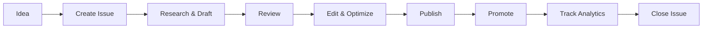
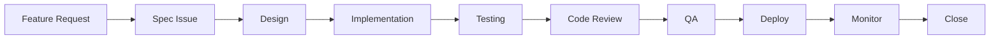

# Linear Standard Operating Procedures (SOP)

> Complete guide for maximizing Linear effectiveness in the PayeTax project

## Table of Contents

- [Overview](#overview)
- [Issue Management](#issue-management)
- [Best Practices](#best-practices)
- [Templates](#templates)
- [Workflows](#workflows)
- [Labels & Organization](#labels--organization)
- [CLI Tools](#cli-tools)

---

## Overview

Linear is our project management tool for tracking issues, features, bugs, and documentation. This SOP ensures consistency, clarity, and efficiency across all team activities.

### Core Principles

1. **Clarity First** - Every issue should be immediately understandable
2. **Actionable** - Issues should have clear next steps
3. **Connected** - Link related issues, PRs, and documentation
4. **Updated** - Keep status and progress current
5. **Archived Properly** - Clean completed or obsolete issues

---

## Issue Management

### Issue Structure

Every Linear issue should follow this structure:

```
Title: [Type] Clear, action-oriented title
Description: Detailed context and requirements
Labels: Type, Priority, Area
Assignee: Who's responsible
Status: Current workflow state
Project: Associated project (if applicable)
Cycle: Associated sprint (if applicable)
Due Date: Target completion (if time-sensitive)
```

### Issue Types

Use these standardized types as prefixes or labels:

| Type | Prefix | Usage | Priority Default |
|------|--------|-------|------------------|
| **Feature** | `feat:` | New functionality | Medium |
| **Bug** | `bug:` | Something broken | High |
| **Content** | `content:` | Blog posts, docs, marketing | Medium |
| **Refactor** | `refactor:` | Code improvements | Low |
| **Test** | `test:` | Add or fix tests | Medium |
| **Docs** | `docs:` | Documentation updates | Low |
| **DevOps** | `devops:` | CI/CD, deployment | High |
| **Analytics** | `analytics:` | Tracking, monitoring | Low |
| **SEO** | `seo:` | Search optimization | Medium |
| **Marketing** | `marketing:` | Promotion, outreach | Medium |
| **Research** | `research:` | Investigation, spike | Low |

### Priority Levels

| Priority | Symbol | When to Use | SLA |
|----------|--------|-------------|-----|
| **Urgent** | 🔴 | Blocking production, security issues | 24 hours |
| **High** | 🟠 | Important features, major bugs | 3-5 days |
| **Medium** | 🟡 | Standard work items | 1-2 weeks |
| **Low** | 🟢 | Nice-to-haves, minor improvements | No deadline |
| **None** | ⚪ | Backlog, ideas | Someday/Maybe |

---

## Best Practices

### Writing Great Titles

✅ **Good Examples:**
- `feat: Add dark mode toggle to settings page`
- `bug: Calculator breaks with negative input values`
- `content: Write blog post about IR35 changes for contractors`
- `docs: Update API documentation for tax calculation endpoint`

❌ **Bad Examples:**
- `Fix bug` (too vague)
- `New feature` (no context)
- `Update stuff` (unclear)
- `Todo` (not actionable)

### Writing Detailed Descriptions

Every issue should include:

1. **Context** - Why is this needed?
2. **Requirements** - What exactly needs to be done?
3. **Acceptance Criteria** - How do we know it's complete?
4. **Resources** - Links to docs, designs, or related issues
5. **Technical Notes** - Implementation hints (if applicable)

**Template:**

```markdown
## Context
[Why this issue exists and what problem it solves]

## Requirements
- [ ] Requirement 1
- [ ] Requirement 2
- [ ] Requirement 3

## Acceptance Criteria
- [ ] Criterion 1
- [ ] Criterion 2
- [ ] Tests pass
- [ ] Documentation updated

## Resources
- Related issue: [PAYTAX-X]
- Design: [Link]
- Docs: [Link]

## Technical Notes
[Optional: Implementation details, gotchas, or suggestions]
```

### Using Labels Effectively

#### Standard Label Categories

1. **Type Labels** (required)
   - `Feature`, `Bug`, `Content`, `Docs`, etc.

2. **Area Labels** (recommended)
   - `Frontend`, `Backend`, `Infrastructure`, `Design`, `Marketing`

3. **Status Labels** (optional)
   - `Blocked`, `Needs Review`, `In Progress`, `Ready`

4. **Platform Labels** (for content)
   - `Blog`, `Twitter/X`, `LinkedIn`, `Newsletter`

5. **Topic Labels** (for organization)
   - `Tax`, `Calculator`, `PAYE`, `Analytics`, `SEO`

### Workflow States

Use Linear's built-in workflow states effectively:

| State | Meaning | When to Use |
|-------|---------|-------------|
| **Backlog** | Not scheduled | Ideas, future work |
| **Todo** | Ready to start | Prioritized, all info available |
| **In Progress** | Actively working | When you begin work |
| **In Review** | Awaiting review | PR submitted, needs approval |
| **Done** | Completed | Merged, deployed, verified |
| **Canceled** | Won't do | Deprioritized or obsolete |

---

## Templates

### Blog Post Issue Template

```markdown
Title: content: [Blog Post Title]
Priority: Medium
Labels: Content, Blog, SEO
Due Date: [Target publication date]

## Context
Writing a blog post about [topic] to [target audience benefit].

## Article Details
- **Topic:** [Main subject]
- **Target Audience:** [Who this is for]
- **Keywords:** [Primary SEO keywords]
- **Word Count:** [Target: 800-1500 words]
- **Tone:** [Professional/Friendly/Technical]

## Requirements
- [ ] Research topic and gather data
- [ ] Write first draft
- [ ] Add relevant examples/screenshots
- [ ] SEO optimization (meta, headings, keywords)
- [ ] Internal linking to related content
- [ ] Proofread and edit
- [ ] Create featured image
- [ ] Submit for review

## Acceptance Criteria
- [ ] Article meets word count target
- [ ] All SEO elements optimized
- [ ] No spelling/grammar errors
- [ ] Mobile-friendly formatting
- [ ] Images optimized (<100KB each)

## Distribution
- [ ] Publish to website
- [ ] Create social posts (Twitter/X, LinkedIn)
- [ ] Send in newsletter (if applicable)
- [ ] Update sitemap

## Resources
- Content calendar: [Link]
- SEO guidelines: [Link]
- Brand voice guide: [Link]
```

### Social Media Post Issue Template

```markdown
Title: marketing: Create X/Twitter post about [Topic]
Priority: Medium
Labels: Marketing, Twitter/X, Content
Parent Issue: [Link to main content issue]

## Context
Promoting [blog post/feature/announcement] on X.com to drive engagement and traffic.

## Post Details
- **Platform:** X.com (Twitter)
- **Type:** [Thread/Single/Poll]
- **Goal:** [Awareness/Traffic/Engagement]
- **Target Audience:** [Who we're reaching]

## Requirements
- [ ] Write compelling hook
- [ ] Draft main content (max 280 chars per tweet)
- [ ] Add relevant hashtags (max 2-3)
- [ ] Include link (with UTM parameters)
- [ ] Create/attach visual (if applicable)
- [ ] Schedule optimal posting time

## Acceptance Criteria
- [ ] Copy is clear and engaging
- [ ] Link includes UTM tracking
- [ ] Visual is optimized (if used)
- [ ] Hashtags are relevant and researched
- [ ] Scheduled for peak engagement time

## Distribution Checklist
- [ ] Posted on X.com
- [ ] Monitor engagement first 2 hours
- [ ] Respond to comments/questions
- [ ] Track analytics after 24h

## Post Copy
```
[Draft your tweet(s) here]

Hashtags: #UKTax #PAYE #TaxTips
Link: [URL with UTM parameters]
```

## Resources
- Main content: [Link to blog post issue]
- Social media calendar: [Link]
- Analytics dashboard: [Link]
```

### Feature Development Issue Template

```markdown
Title: feat: [Feature Name]
Priority: [Urgent/High/Medium/Low]
Labels: Feature, Frontend/Backend, [Area]

## Context
[Why we need this feature and what problem it solves]

## User Story
As a [type of user], I want [goal] so that [benefit].

## Requirements
- [ ] Requirement 1
- [ ] Requirement 2
- [ ] Requirement 3

## Technical Approach
- Tech stack: [Technologies to use]
- Components: [What needs to be built]
- APIs: [Endpoints needed]
- Database: [Schema changes if any]

## Acceptance Criteria
- [ ] Feature works as described
- [ ] Unit tests pass (>80% coverage)
- [ ] E2E tests pass
- [ ] No accessibility regressions
- [ ] No performance regressions
- [ ] Documentation updated
- [ ] Merged to main

## Design
- Figma: [Link]
- User flow: [Link]

## Related Issues
- Depends on: [Links]
- Blocks: [Links]
- Related: [Links]
```

### Bug Fix Issue Template

```markdown
Title: bug: [Clear description of the bug]
Priority: [Urgent/High based on severity]
Labels: Bug, [Area]

## Bug Description
[Clear description of what's broken]

## Steps to Reproduce
1. Step 1
2. Step 2
3. Step 3

## Expected Behavior
[What should happen]

## Actual Behavior
[What actually happens]

## Environment
- Browser: [Chrome/Firefox/Safari]
- OS: [Windows/Mac/Linux]
- Device: [Desktop/Mobile/Tablet]
- URL: [Where bug occurs]

## Screenshots/Videos
[Attach visual evidence]

## Error Messages
```
[Paste any error messages or logs]
```

## Possible Cause
[If known, describe what might be causing this]

## Acceptance Criteria
- [ ] Bug no longer reproduces
- [ ] Regression tests added
- [ ] No new bugs introduced
- [ ] Related edge cases tested
```

---

## Workflows

### Content Creation Workflow



**Steps:**

1. **Idea Phase** → Create issue with rough concept
2. **Planning** → Fill out template, set priority/due date
3. **Research** → Gather data, links, resources
4. **Drafting** → Write first version
5. **Review** → Internal review, edit
6. **SEO** → Optimize keywords, meta, headings
7. **Publish** → Deploy to website
8. **Promote** → Create social posts (separate issues)
9. **Monitor** → Track analytics
10. **Close** → Archive issue when complete

### Feature Development Workflow



**States Mapping:**

- Backlog → Feature request received
- Todo → Spec complete, ready for dev
- In Progress → Actively coding
- In Review → PR submitted
- Done → Merged & deployed

---

## Labels & Organization

### Creating a Label System

#### Recommended Labels for PayeTax:

**Type Labels:**
- `Feature` - New functionality
- `Bug` - Something broken
- `Content` - Blog, docs, marketing
- `Refactor` - Code improvement
- `Test` - Testing related
- `DevOps` - Infrastructure
- `SEO` - Search optimization

**Area Labels:**
- `Frontend` - React, UI components
- `Backend` - API, server logic
- `Calculator` - Tax calculation engine
- `Blog` - Blog system
- `Analytics` - Tracking, monitoring
- `Marketing` - Promotion, outreach

**Platform Labels:**
- `Twitter/X`
- `LinkedIn`
- `Blog`
- `Newsletter`

**Status Labels:**
- `Blocked` - Can't proceed
- `Needs Info` - Missing requirements
- `Good First Issue` - For new contributors

### Using Projects

Create projects for major initiatives:

- **Blog Content Q1 2025**
- **Calculator v3 Rebuild**
- **SEO Overhaul**
- **Marketing Campaign**

Assign related issues to projects for tracking progress.

### Using Cycles

Set up 2-week sprints (cycles) to batch work:

- **Sprint 1:** Jan 1-14
- **Sprint 2:** Jan 15-28
- etc.

Assign issues to cycles during planning.

---

## CLI Tools

### PayeTax Linear CLI

We've built a custom CLI for Linear operations.

#### Installation & Setup

```bash
# Environment variables (.env.local)
LINEAR_API_KEY=lin_api_xxxxxxxxxxxxxxxx
LINEAR_TEAM_KEY=PAYTAX
```

#### Available Commands

```bash
# List all issues
npm run linear:list

# List issues assigned to you
npm run linear:me

# Create new issue (interactive)
npm run linear:create

# Create issue with title
node scripts/linear.js create "feat: Add dark mode"

# Update issue status
node scripts/linear.js update-status PAYTAX-24 Done
node scripts/linear.js update-status PAYTAX-34 "In Progress"

# Update issue description (simple, one-line)
node scripts/linear.js update-description PAYTAX-84 "New description"

# Update issue description (complex, multiline with markdown)
node -e "
const { LinearClient } = require('@linear/sdk');
const linear = new LinearClient({ apiKey: process.env.LINEAR_API_KEY });
(async () => {
  const issue = await linear.issue('PAYTAX-84');
  await issue.update({
    description: \`**AUDIT COMPLETE - 7 Issues Found**

✅ GOOD PATTERNS:
- Pattern 1 ✅
- Pattern 2 ✅

❌ ISSUES:
1. Issue one
2. Issue two

Files audited: file.tsx (242 lines)\`
  });
  console.log('✅ Updated PAYTAX-84');
})();
"

# Delete issue(s)
node scripts/linear.js delete PAYTAX-123
node scripts/linear.js delete PAYTAX-1 PAYTAX-2 PAYTAX-3

# View projects
npm run linear:projects

# View cycles
npm run linear:cycles

# Workspace info
npm run linear:info
```

#### Creating Issues via CLI

**Interactive Mode:**
```bash
npm run linear:create
```

**Quick Create:**
```bash
node scripts/linear.js create "content: Write blog about IR35" "Article explaining IR35 changes for contractors" --high --me
```

#### Best Practices with CLI

1. **Batch Operations** - Delete/create multiple issues at once
2. **Use Templates** - Keep common issue formats in docs
3. **Automate** - Script repetitive tasks (e.g., weekly content issues)
4. **Track** - Always use proper labels and priorities

---

## Automation Ideas

### Recurring Tasks

Create issues for recurring work:

```bash
# Weekly blog post
node scripts/linear.js create "content: Weekly blog post - Week of [DATE]"

# Monthly analytics review
node scripts/linear.js create "analytics: Monthly review - [MONTH]"
```

### Integration with Git

Link commits and PRs to issues:

```bash
git commit -m "feat: Add dark mode - Fixes PAYTAX-42"
```

Linear automatically links the commit to the issue.

### Slack/Discord Integration

Set up Linear notifications:
- New issues created
- Issues completed
- Blockers flagged

---

## Metrics & Analytics

### Track These KPIs

1. **Issue Velocity** - How many issues completed per cycle
2. **Time to Close** - Average time from creation to completion
3. **Backlog Health** - Ratio of backlog to active issues
4. **Bug Rate** - Bugs opened vs features shipped
5. **Content Pipeline** - Blog posts published per month

### Review Cadence

- **Daily:** Check assigned issues, update status
- **Weekly:** Review cycle progress, adjust priorities
- **Monthly:** Clean backlog, archive old issues
- **Quarterly:** Review label usage, workflow effectiveness

---

## Common Scenarios

### Scenario: Planning a Blog Post

1. Create issue: `content: [Blog Title]`
2. Use Blog Post Template
3. Set due date (publication target)
4. Add labels: `Content`, `Blog`, `SEO`
5. Assign to writer
6. Link related social media issues
7. Track in Content Project/Cycle

### Scenario: Promoting Blog on Social

1. Create child issue: `marketing: X post about [Blog Title]`
2. Link to parent blog issue
3. Use Social Media Post Template
4. Add labels: `Marketing`, `Twitter/X`
5. Include UTM tracking links
6. Schedule posting time

### Scenario: Fixing a Critical Bug

1. Create issue: `bug: [Clear description]`
2. Set priority: Urgent/High
3. Use Bug Template with full details
4. Add `Blocked` label if blocking users
5. Assign immediately
6. Move to In Progress
7. Create PR and link issue
8. Test thoroughly
9. Deploy and monitor
10. Close issue

---

## Appendix

### Quick Reference

**Issue Creation Checklist:**
- [ ] Clear, actionable title with type prefix
- [ ] Detailed description with context
- [ ] Acceptance criteria defined
- [ ] Appropriate labels added
- [ ] Priority set correctly
- [ ] Assignee designated
- [ ] Due date set (if time-sensitive)
- [ ] Linked to related issues/projects
- [ ] Resources and links included

**Issue Closure Checklist:**
- [ ] All acceptance criteria met
- [ ] Tests passing
- [ ] Documentation updated
- [ ] PR merged (if code change)
- [ ] Deployed to production (if applicable)
- [ ] Stakeholders notified
- [ ] Analytics/monitoring confirmed

### Resources

- [Linear Documentation](https://linear.app/docs)
- [Linear API Docs](https://developers.linear.app/)
- [Linear Best Practices](https://linear.app/method)
- PayeTax Docs: `docs/README.md`
- CLI Script: `scripts/linear.js`

---

## Changelog

- **2025-01-XX** - Initial SOP created
- Added comprehensive templates
- Added CLI tools documentation
- Defined label system and workflows

---

**Questions or Suggestions?**

This SOP is a living document. If you have ideas for improvements, create an issue:

```bash
npm run linear:create
# Title: docs: Update LINEAR_SOP.md - [Your suggestion]
```
